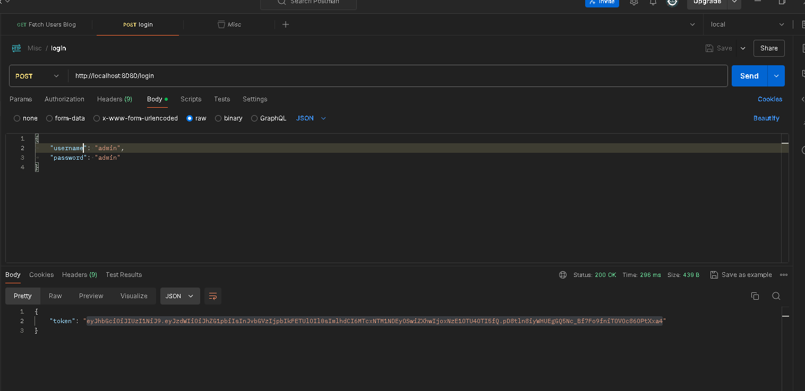
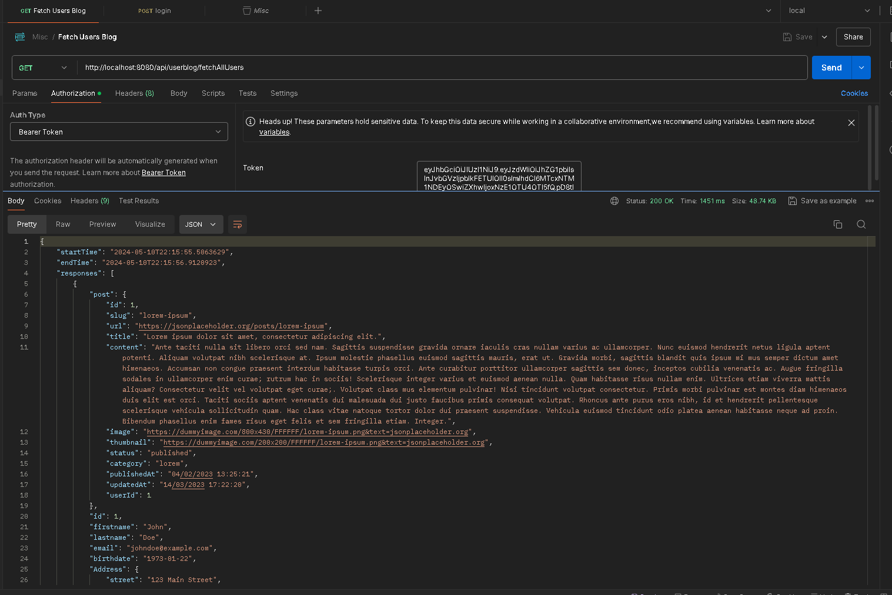

# blogapp

# Admin username : admin
# Admin password : admin

Login with url to get access token : http://localhost:8080/login 

Run API  http://localhost:8080/api/userblog/fetchAllUsers
put token in Authorization Bearer.

